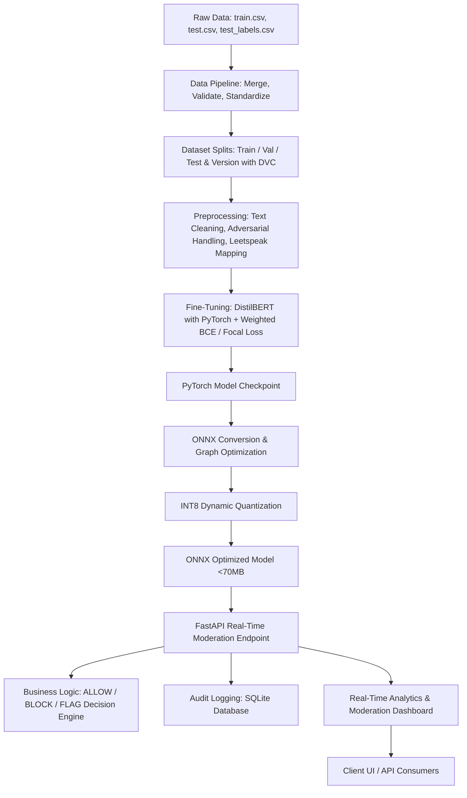

# Real-Time Content Moderation System - Implementation Plan

This plan details the design and deployment of an end-to-end, production-grade real-time content moderation system. It leverages DistilBERT fine-tuning, ONNX optimization (including dynamic quantization), FastAPI, SQLite logging, Docker, and MLOps best practices.

The system will ingest the classic Wikipedia Toxic Comment Classification dataset, merge the train and labeled test splits (producing ~224k comments), fine-tune a multi-label model to detect 5 distinct policy violations, optimize it for CPU/GPU deployment to achieve `<50ms` latency, and serve it via a FastAPI backend connected to a SQLite database and a premium Vanilla HTML/CSS dashboard.

---

## Architecture Design

---

## User Review Required

> [!IMPORTANT]
> **Data Size & GPU Memory (VRAM)**
> Merging the datasets yields 223,549 comments. Fine-tuning DistilBERT on 223k comments on a GTX 1650 (4GB VRAM) requires aggressive optimization. We will implement:
> - Batch size of `8` (or `4` if needed)
> - Gradient accumulation (`8` or `16` steps) to simulate larger batch sizes
> - Mixed precision training (`fp16=True`)
> - Automatic down-sampling configuration (e.g. `--subset 30000` stratified samples) in the training script to allow fast and stable training in local test runs without out-of-memory errors, while keeping the full pipeline compatible with the entire dataset.

> [!TIP]
> **Threshold Tuning for ~91% Precision**
> Because the class distribution is heavily imbalanced (e.g., threat is <0.4%), a standard 0.5 threshold will fail to hit 91% precision. We will implement an automated threshold-search script that finds individual optimal probability thresholds for each classification category (Toxicity, Hate Speech, Obscene, Harassment, Threat) on the validation set to meet the precision goal.

---

## Open Questions

> [!NOTE]
> 1. **DVC Remote**: For dataset versioning, since there is no active cloud bucket, we will configure a local directory as a mock remote (`.dvc_local_remote`). This enables running complete DVC pipelines and testing commands locally.
> 2. **Emoji and Slang Dictionaries**: We will construct a lightweight, high-performance dictionary mapping for common internet slangs and emojis inside the preprocessor to prevent external package download failures and maintain fast inference speeds.

---

## Proposed Changes

We will create the following component directories and files within the workspace `c:/Users/msach/OneDrive/Desktop/Real-Time Content Moderation`.

### 1. Project Configuration & Data Pipeline

#### [NEW] [config.py](file:///c:/Users/msach/OneDrive/Desktop/Real-Time%20Content%20Moderation/src/config.py)
Defines project settings, database paths, target model folders, category thresholds (allow, block, review limits), and label column maps.

#### [NEW] [database.py](file:///c:/Users/msach/OneDrive/Desktop/Real-Time%20Content%20Moderation/src/database.py)
Handles SQLite database connection, table initialization, request audit logging (storing raw input, category probabilities, final moderation decision, and processing latency), and analytics queries.

#### [NEW] [data_pipeline.py](file:///c:/Users/msach/OneDrive/Desktop/Real-Time%20Content%20Moderation/src/data_pipeline.py)
- Ingests raw data from `train.csv` and `test_labels.csv`.
- Filters out `-1` values from the test labels to retrieve labeled test data.
- Merges the datasets (~224k total records).
- Performs schema checks and splits data into Train (80%), Val (10%), and Test (10%) sets.
- Tracks files and folders with DVC.

### 2. Preprocessing & Model Architecture

#### [NEW] [preprocessor.py](file:///c:/Users/msach/OneDrive/Desktop/Real-Time%20Content%20Moderation/src/preprocessor.py)
Text cleaning functions:
- Lowercasing, URL removal, mention removal.
- Adversarial text handling (mapping obfuscations like `f*ck`, `f**k`, `a$$`, `b!tch`, `c0ck`, `@ss` to standard forms).
- Slang and emoji normalization.
- Tokenization using Hugging Face's `DistilBertTokenizerFast` with sequence truncation and dynamic padding.

#### [NEW] [model.py](file:///c:/Users/msach/OneDrive/Desktop/Real-Time%20Content%20Moderation/src/model.py)
- Defines the DistilBERT multi-label classifier.
- Implements custom loss options: **Weighted BCE Loss** and **Focal Loss** to counteract the massive class imbalance.

#### [NEW] [train.py](file:///c:/Users/msach/OneDrive/Desktop/Real-Time%20Content%20Moderation/src/train.py)
- Fine-tunes the model using PyTorch and Hugging Face Trainer.
- Implements mixed-precision (`fp16`), gradient accumulation, validation metrics logging, checkpoint saving, and early stopping.
- Supports training on GPU or CPU.

### 3. Optimization & ONNX Inference

#### [NEW] [export_onnx.py](file:///c:/Users/msach/OneDrive/Desktop/Real-Time%20Content%20Moderation/src/export_onnx.py)
- Converts the fine-tuned PyTorch model into ONNX format.
- Performs graph optimizations (constant folding, layer fusion).
- Applies **dynamic quantization** to shrink model size (to ~67MB) and optimize for CPU latency.

#### [NEW] [predict_onnx.py](file:///c:/Users/msach/OneDrive/Desktop/Real-Time%20Content%20Moderation/src/predict_onnx.py)
- ONNX Runtime wrapper for high-performance inference.
- Implements pre-tokenization, ONNX Runtime session execution, and probability scaling.

### 4. Evaluation & Moderation Engine

#### [NEW] [evaluate.py](file:///c:/Users/msach/OneDrive/Desktop/Real-Time%20Content%20Moderation/src/evaluate.py)
- Computes multi-label metrics: Precision, Recall, F1, Accuracy, ROC-AUC, and Confusion Matrix.
- Runs optimal threshold searching on the validation set to enforce a `~91% precision` target.

### 5. Web API & Dashboard UI

#### [NEW] [schemas.py](file:///c:/Users/msach/OneDrive/Desktop/Real-Time%20Content%20Moderation/api/schemas.py)
Pydantic schemas for request validation (`ModerateRequest`, `BatchModerateRequest`) and response output.

#### [NEW] [main.py](file:///c:/Users/msach/OneDrive/Desktop/Real-Time%20Content%20Moderation/api/main.py)
FastAPI application that serves:
- `POST /moderate` - Moderate single text.
- `POST /moderate/batch` - Moderate list of texts.
- `GET /analytics` - Return database metrics (average latency, blocks/allows ratios).
- `GET /` - Serves the premium visual frontend dashboard.

#### [NEW] [index.html](file:///c:/Users/msach/OneDrive/Desktop/Real-Time%20Content%20Moderation/api/static/index.html)
A stunning, glassmorphism-themed real-time moderation UI. Contains:
- Text input box for live moderation tests.
- Visual gauges/progress bars showing model confidence scores for each category.
- Allow/Block/Flag banners with micro-animations.
- High-performance logging table showing recent moderation transactions stored in SQLite.
- Live system health cards (latency, throughput, container CPU usage).

### 6. Deployment & Configuration

#### [NEW] [requirements.txt](file:///c:/Users/msach/OneDrive/Desktop/Real-Time%20Content%20Moderation/requirements.txt)
Lists all python dependencies (torch, transformers, onnx, onnxruntime, fastapi, uvicorn, scikit-learn, dvc, sqlite3, pydantic, etc.).

#### [NEW] [Dockerfile](file:///c:/Users/msach/OneDrive/Desktop/Real-Time%20Content%20Moderation/Dockerfile)
Multi-stage Dockerfile containing runtime setups, loading the optimized ONNX model, and running the FastAPI server.

#### [NEW] [docker-compose.yml](file:///c:/Users/msach/OneDrive/Desktop/Real-Time%20Content%20Moderation/docker-compose.yml)
Runs the containerized FastAPI server, maps database volumes, and configures environment variables.

---

## Verification Plan

### Automated Tests
1. **Unit & Pipeline Tests**:
   - Run `pytest tests/` to verify:
     - Preprocessor (text cleaning, leetspeak mapping).
     - Data pipeline (merging, validation, splits).
     - SQLite logging functions (read, write, schema).
     - FastAPI endpoints status and input validations.
2. **ONNX Optimization Verification**:
   - Convert model to ONNX, quantize, and verify output dimensions match.
   - Run `python benchmark/run_benchmark.py` to assert that average CPU latency per request is `<50ms` (target is actually <20ms on modern processors with INT8 quantization) and record throughput.

### Manual Verification
1. **Dashboard Check**:
   - Open browser at `http://localhost:8000`.
   - Submit toxic comments (e.g. "Stupid piece of shit go die and fall in a hole") and verify it is **blocked** or **flagged**, logged to SQLite, and rendered live in the log table.
   - Verify allow responses on friendly sentences (e.g. "Thanks for the nice contribution!").
